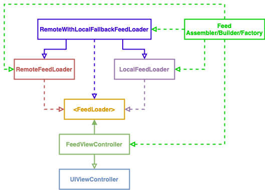

# AmazingPhotos
An open-source project designed to apply some learnings from the iOS Lead Essentials course (https://academy.essentialdeveloper.com) while presenting a nice collection of amazing photographs. 

## BDD Specs

### Story: Customer requests to see their photos feed

### Narrative #1

> As an online customer
I want the app to automatically load the latest photos feed
So I can always enjoy the newest photos

#### Scenarios (Acceptance criteria)

```
Given the customer has connectivity
When the customer requests to see the feed
Then the app should display the latest feed from remote
  And replace the cache with the new feed
```

### Narrative #2

> As an offline customer
I want the app to show the latest saved version of the photos feed
So I can always enjoy photos

#### Scenarios (Acceptance criteria)

```
Given the customer doesn't have connectivity
And there’s a cached version of the feed
When the customer requests to see the feed
Then the app should display the latest feed saved

Given the customer doesn't have connectivity
And the cache is empty
When the customer requests to see the feed
Then the app should display an error message
```

## Use Cases

### Load Feed Use Case

#### Data:
- URL

#### Primary course (happy path):
1. Execute "Load Feed Items" command with above data.
2. System downloads data from the URL.
3. System validates downloaded data.
4. System creates feed items from valid data.
5. System delivers feed items.

#### Invalid data – error course (sad path):
1. System delivers error.

#### No connectivity – error course (sad path):
1. System delivers error.

### Load Feed Fallback (Cache) Use Case

#### Data:
- Max age

#### Primary course:
1. Execute "Retrieve Feed Items" command with above data.
2. System fetches feed data from cache.
3. System validates cache age.
4. System creates feed items from cached data.
5. System delivers feed items.

#### Expired cache course (sad path): 
1. System delivers no feed items.

#### Empty cache course (sad path): 
1. System delivers no feed items.


### Save Feed Items Use Case

#### Data:
- Feed items

#### Primary course (happy path):
1. Execute "Save Feed Items" command with above data.
2. System encodes feed items.
3. System timestamps the new cache.
4. System replaces the cache with new data.
5. System delivers success message.

## Flowchart


## Architecture



## Model Specs

### Feed Item

| Property                    | Type                    |
|-----------------------------|-------------------------|
| `id`                        | `String`                |
| `created_at`                | `Date`                  |
| `updated_at`                | `Date`                  |
| `width`                     | `Int`                   |
| `height`                    | `Int`                   |
| `color`                     | `String`                |
| `downloads`                 | `Int`                   |
| `likes`                     | `Int`                   |
| `liked_by_user`             | `Int`                   |
| `description`               | `String`                |
| `exif`                      | `Dictionary`            |
| `location`                  | `Dictionary`            |
| `tags`                      | `Dictionary`            |
| `current_user_collections`  | `[Dictionary]`          |
| `urls`                      | `[URL]`                 |
| `links`                     | `[URL]`                 |
| `user`                      | `Dictionary`            |

### Extra Information

| Property                    | Type                    |
|-----------------------------|-------------------------|
| `make`                      | `String`                |
| `model`                     | `String`                |
| `exposure_time`             | `String`                |
| `aperture`                  | `String`                |
| `focal_lenght`              | `String`                |
| `iso`                       | `Int`                   |

### Location

| Property                    | Type                    |
|-----------------------------|-------------------------|
| `city`                      | `String`                |
| `country`                   | `String`                |
| `position`                  | `Dictionary`            |

### Position

| Property                    | Type                    |
|-----------------------------|-------------------------|
| `latitude`                  | `Double`                |
| `longitude`                 | `Double`                |

### Tag

| Property                    | Type                    |
|-----------------------------|-------------------------|
| `title`                     | `String`                |

### User Collection

| Property                    | Type                    |
|-----------------------------|-------------------------|
| `id`                        | `String`                |
| `title`                     | `String`                |
| `published_at`              | `String`                |
| `last_collected_at`         | `String`                |
| `updated_at`                | `String`                |
| `cover_photo`               | `String` (optional)     |
| `user`                      | `Dictionary` (optional) |

### Payload contract

```
GET *url* (TBD)

200 RESPONSE
[
  {
    "id": "LBI7cgq3pbM",
    "created_at": "2016-05-03T11:00:28-04:00",
    "updated_at": "2016-07-10T11:00:01-05:00",
    "width": 5245,
    "height": 3497,
    "color": "#60544D",
    "likes": 12,
    "liked_by_user": false,
    "description": "A man drinking a coffee.",
    "user": {
      "id": "pXhwzz1JtQU",
      "username": "poorkane",
      "name": "Gilbert Kane",
      "portfolio_url": "https://theylooklikeeggsorsomething.com/",
      "bio": "XO",
      "location": "Way out there",
      "total_likes": 5,
      "total_photos": 74,
      "total_collections": 52,
      "instagram_username": "instantgrammer",
      "twitter_username": "crew",
      "profile_image": {
        "small": "https://images.unsplash.com/face-springmorning.jpg?q=80&fm=jpg&crop=faces&fit=crop&h=32&w=32",
        "medium": "https://images.unsplash.com/face-springmorning.jpg?q=80&fm=jpg&crop=faces&fit=crop&h=64&w=64",
        "large": "https://images.unsplash.com/face-springmorning.jpg?q=80&fm=jpg&crop=faces&fit=crop&h=128&w=128"
      },
      "links": {
        "self": "https://api.unsplash.com/users/poorkane",
        "html": "https://unsplash.com/poorkane",
        "photos": "https://api.unsplash.com/users/poorkane/photos",
        "likes": "https://api.unsplash.com/users/poorkane/likes",
        "portfolio": "https://api.unsplash.com/users/poorkane/portfolio"
      }
    },
    "current_user_collections": [ // The *current user's* collections that this photo belongs to.
      {
        "id": 206,
        "title": "Makers: Cat and Ben",
        "published_at": "2016-01-12T18:16:09-05:00",
        "last_collected_at": "2016-06-02T13:10:03-04:00",
        "updated_at": "2016-07-10T11:00:01-05:00",
        "cover_photo": null,
        "user": null
      },
      // ... more collections
    ],
    "urls": {
      "raw": "https://images.unsplash.com/face-springmorning.jpg",
      "full": "https://images.unsplash.com/face-springmorning.jpg?q=75&fm=jpg",
      "regular": "https://images.unsplash.com/face-springmorning.jpg?q=75&fm=jpg&w=1080&fit=max",
      "small": "https://images.unsplash.com/face-springmorning.jpg?q=75&fm=jpg&w=400&fit=max",
      "thumb": "https://images.unsplash.com/face-springmorning.jpg?q=75&fm=jpg&w=200&fit=max"
    },
    "links": {
      "self": "https://api.unsplash.com/photos/LBI7cgq3pbM",
      "html": "https://unsplash.com/photos/LBI7cgq3pbM",
      "download": "https://unsplash.com/photos/LBI7cgq3pbM/download",
      "download_location": "https://api.unsplash.com/photos/LBI7cgq3pbM/download"
    }
  },
  // ... more photos
]
```
